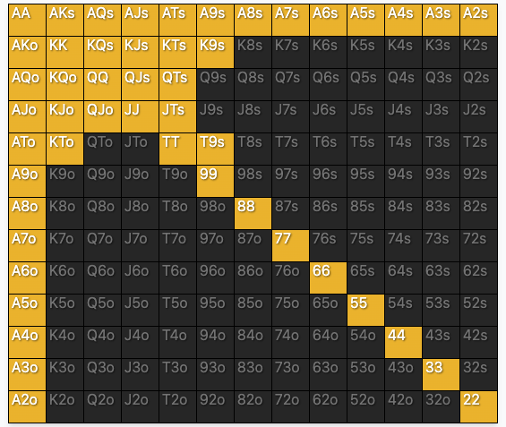

# 08. Playing Accrately, Part Ⅱ: hand vs. Distribution

- ハンドリーディングとストラテジーリーディングのプロセスが終了した後、それらのプロセスによって集められた情報をもとに、異なるアクションのEVを比較することによって、どのアクションを取るべきかを判断することができます。
- 対戦相手のプレーの弱点を定性的に把握することは、たとえテーブルですべての計算ができなくても、正しいエクスプロイトプレーを特定するのに役立つことが多いです。
- 一般的にエクスプロイトが必要とされる状況に対する直感を養うことは、テーブルでエクスプロイト的なプレーをする上で非常に役立ちます。
- 対戦相手が様々なハンドを持っている場合、相手の異なるハンドに対して異なるアクションを取りたいと思うことがよくあります。相手がそれぞれのハンドを持っている確率をベイズ推定で調整した値で期待値を重み付けすると、相手のハンドレンジ全体に対してでも正確な判断ができるようになります。
- Showdown-EQとは，すべてのカードを配った直後の各ハンドの期待値です。Ex-Showdown-EQとは、ポストフロップのアクションを含めた場合の各ハンドが持つ期待値です。

---

ポーカーは、ハンドは公開されていない方が、より面白いゲームになります。よって、不完全情報のポーカーゲームが人気です。ここで、1つのハンドだけがオープンされ、他のハンドはある種の分布である場合を考えてみます。このような場合、相手の戦略を正確に把握することができれば、先に述べた期待値の手法を使って、最適なプレイを導き出すことができます。当面は、相手の戦略の変化には関心を持たず、相手がどのようなハンドを使うかを確実に推定できると考えることにします。プレイヤーの戦略の変化や、個々のハンドの戦略の違いによる分布全体の価値の変化については、後の章で詳しく説明することにします。

しかし、特定のゲームの分析に深入りする前に、より複雑なゲームを分析しようとするときに貴重な役割を果たす概念について説明することができます。この概念は、ホールデムのようなゲームにおいて特に価値があります。よくあるのは、ポストフロップに2つのハンドが何らかのアクションを起こし、ポストフロップでまだかなりの量のチップが残っている状態で、どちらかのハンドがコールするケースです。このようにコールでプレイが終了した場合、両プレイヤーのハンドに対する期待値を知り、例えばリレイズした場合の期待値と比較したいと思うことがよくあります。

一つは**Showdown-EQ**と呼ばれるもので、これは、ベットをせず、すぐにすべてのカードを配った場合の各ハンドの期待値です。もう1つは、**Ex-Showdown-EQ**と呼ばれるもので、ポストフロップのアクションも含めた場合の各ハンドが持つ期待値です。Ex-はラテン語の接頭語で「外」を意味し、したがってEx-Showdown-Equityは現在のポットを除いた時のエクイティとなります。この2つの値の合計が、プレーヤーがポットに対して持つ期待値の合計となります。この2つの値は、各プレイヤーが持っているハンドレンジの強さに依存するため、実は関連しているのです。あるプレイヤーのShowdown-EQがプラスで、Ex-Showdown-EQがマイナスということはよくあることです。例えば、あるプレイヤーが極めて弱いドローを持っていて、相手がベットした場合です。Showdown-EQは、ベットの前にポットの何倍ものお金を稼ぐ確率と同じです。しかし、フォールドしなければならないので、Ex-Showdown-EQは、実際には負けているため、その値のマイナスとなり、そのハンドからのEQの合計はゼロとなります。

あらゆる可能性のあるボードとプレイヤーの戦略について、ハンドのプレイ全体を投影し、そのようにハンドをプレイした場合のEVを確認することが理想です。残念ながら、これはかなり難解な問題で、特にテーブルの上では難しいです。そこで、直感を働かせて、ある一定の範囲内のエクイティを推測することを試みます。例えば、両者の分布がほぼ等しく、両者の腕前も同じであるようなハンドを考えてみましょう。この場合、Showdown-EQは等しくなり、この2人のプレイヤーのEx-Showdown-EQに最も重要な影響を与えるのはポジションです。BTNのプレイヤーは、ポジションの優位性から、他のプレイヤーよりもEx-Showdown-EQが高くなります。

例えば、一方のプレイヤーが\[AA, KK, QQ, AK\]のような非常に強いハンドレンジを持ち、もう一方のプレイヤーがランダムなハンドを持っていることが知られている状況を考えてみましょう。この場合、強いハンドレンジを持つプレイヤーは相手よりもShowdown-EQがずっと高くなります。しかし、Ex-Showdown-EQのアドバンテージは、広いレンジのハンドを持つことができる状況で、これらのハンドの1つを持つ場合よりも小さくなります。また、ハンドレンジの中の特定のハンドのEQを示すこともできます。例えば，FLHの典型的なBTNのレイズレンジを想定すると、BBの強いプレイヤーに対して、BTNでAを持つことは、Ex-Showdown-EQに4sb-5sbと同じだけの価値があるかもしれないということです。

プリフロップでコールするようなゲームを分析する場合、コール後にプレイヤーが「ポットのX%」を持つという言い方をすることがあります。プリフロップでオールインした場合などでは、これは厳密にShowdown-EQとなる場合があります。しかし、他のケースでは、将来のベットがプレイヤーの期待値に与える影響を捉えようとしています。この例については、すぐに見ていきましょう。

多くのタイプのエクスプロイト(搾取)は非常に簡単です。例えば、ブラフを多用する相手に対しては、ブラフにしか勝てない追加ハンドでコールするのが最も利益の高いプレイであり、ベットにフォールドすることが多い相手に対しては、弱いハンドで最も期待値の高いプレイは一般的にブラフになります。これらのケースは経験則であり、その状況に適した期待値分析を適切に表現していることが多いです。しかし、もっと複雑な状況でも、各戦略のEVを評価し、最も高いものを選ぶという方法論を適用するだけで、分析することができるのです。

## Ex.8-1

\$5-\$10のNLHでBBです。私たちがよく知るプレイヤーであるBTNのスタックは\$200です。BTNは\$30でオープンしました。SBはフォールドしました。

私たちはBTNのプレイについて次のことがわかっています。

- BTNのレイズ分布は\{22+, A2+, KT+, K9s+, QTs+, QJ+, JTs, T9s\}です。
    
- もしBB(自分)がジャム(Re-Raise\$170)すれば、BTNはAA-JJとAKでコールし、他のハンドは全てフォールドします。

もし自分がコールすれば、コールしたハンドの数に応じて、ポットの一部を手にすることが期待できます。例えば、彼がレイズしているのと同じ範囲のハンドでコールした場合、ポストフロップのプレイから得られるポット(ポジションによる不足分)に対して約45％のエクイティを持つことが期待できます。

私たちの最大限の搾取戦略はなんでしょうか？

相手は合計350/1326のハンドでレイズしてきます。

- ポケットペア = 78通り
- Aハイ = 192通り
- オフスート = 48通り
- スーテッド = 32通り

しかし、相手は自分のレイズに対して、40のハンドでしかコールしません。これらの比率は、カードのブロッカー効果(自分がAを持っていれば、相手はAAを作る場合の数が少なくなるなど)によって若干影響を受けます。以降の分析ではこのベースを使うことにします。

ポットの\$45を獲得するために\$190(ブラインドを置いた後の残りのスタック)のリスクを負うことになります。さらに、コールされた場合、ポットのEQが低いにもかかわらず、勝つこともあります。\{AA-JJ, AK\}のレンジに対して、私たちのランダムハンドのEQは約24.95%です。非常に強いレンジに対してでさえ、ランダムな2枚のカードでポットのほぼ4分の1を持っていることに注意してください。

この結果、このジャミングプレイの総合的なEVは、次のようになります。

$\langle jam \rangle= p(he\ folds)(pot) + p(he\ calls) \lbrace p(we\ win)(new\ pot) - (cost\ of\ jam) \rbrace$  
$\langle jam \rangle = 0.8857 \cdot 45 + (1 - 0.8857) \cdot (0.2495 \cdot (200 + 200 + 5) - 190)$  
$\langle jam \rangle = 29.69$

これはかなり重要なポイントです。どんなに弱いハンドでも、ここでジャムすれば、EVはプラスになります。相手の戦略には重大な欠陥があり、相手はリレイズに対してあまりにも頻繁にフォールドします。

また、特定のハンドでも計算してみます。例えば、\{JJ+. AKs, AKo\}に対して、32oはポットの21.81%のEQ持っています。

そうすると、ジャムした場合のEVは、

$\langle 32o, jam \rangle = p(he\ folds)(pot) + p(he\ calls) \lbrace p(we\ win)(new\ pot) - (cost\ of\ jam) \rbrace$  
$\langle 32o, jam \rangle = 0.8857 \cdot 45 + 0.1143 \cdot (0.2181 \cdot 405 - 190)$  
$\langle 32o, jam \rangle = 28.24$

\$20コールして、ポットの割合 $x$ を得るコールと比較します。

$\langle call \rangle = x(new\ pot) - (cost\ of\ call)$  
$\langle call \rangle = 65x - 20$　　

特定のハンドでジャムするのと同じくらいにコーリングを良いプレイにするためには、このEVが\$29.69より大きくなければいけません。

$65x - 20 > 29.69$  
$x > 0.7645$

どんなに才能のあるプレイヤーでも、ポストフロップでBTNに対してポジションからランダムなハンドで76％以上のポットを持つプレイヤーはいないことは明らかです。

しかし、BB(自分)にAAがある場合はどうでしょうか。AAの場合、レイズされるハンドに何らかの大きな差が出るので、ベイズの定理を使ってコール頻度を調整します。デッキからAを2枚抜いて調整した後、BTNは249コンボのハンドをレイズし、そのうち相手はわずか27コンボのハンドでコールし、222コンボをフォールドします。相手のコールハンドに対して、自分のエクイティは83.43%とはるかに高いです。

$\langle AA, jam \rangle = p(he\ folds)(pot) + p(he\ calls) \lbrace p(we\ win)(new\ pot) - (cost\ of\ jam) \rbrace$  
$\langle AA, jam \rangle = \dfrac{222}{249} \cdot 45 + \dfrac{27}{249} \cdot (0.8343 \cdot 405 - 190)$  
$\langle AA, jam \rangle = 56.16$

AAでのコールを正解とするためには、少なくともポットの $x$ (比率)が必要です。

$65x -20 > 56.16$  
$x > 1.172$

特にポストフロップでアグレッシブに攻めてくる相手に対しては、このようなケースもあり得ないわけではありません。しかし、これは私たちが持ちうるすべてのハンドの中で、最も良いケースです。

つまり、この例を要約すると、このタイプのBTNに対しては、どんなハンドでもジャムした方が、フォールドやコールよりもかなり強いプレイになるということです。これは、ブラインドが非常に強いハンドを持っている場合を除き、ポストフロップでのプレーの良し悪しによって、僅差になる可能性があります。

このような分析から見えてくるのは、相手の戦略の欠点、つまり劣勢に立たされるポイントです。上記の例では、BTNの戦略の欠点は、彼は幅広いハンドでレイズしたが、リレイズに対してあまりにも頻繁にフォールドしていることでした。本当は、上記のようなEV分析をするしかないのですが、テーブルでは、次のような簡単な分析がかなり簡単にできます。

「BTNは25％のハンドをレイズしているが、ほとんどコールしかしていない。もし私がジャムすれば、1勝するために4ポットほど投入することになる。もし彼が5分の1以下の確率で私にコールすれば、私はジャムですぐにお金を稼ぐことができるし、時には彼がコールした時にも勝つことができる！」

相手の戦略の弱点を見つけることが、エクスプロイトプレイの核となります。上記のケースでは、BTNの戦略において、レイズするハンドとリレイズを耐えるハンドの数のアンバランスが原因でした。このアンバランスは、任意の2枚のカードでジャムをすることで利益を得ることができる、意識の高いビッグブラインドによる搾取の機会を作り出しました。もしボタンプレイヤーがこのような搾取を防ぎたいのであれば、次の2つのうちの1つを行う必要があります。最初のレイズ条件を厳しくするか、ビッグブラインドからのジャムをコールするハンドの範囲を広くするかです。

相手を利用するもう一つの方法は、一見すると有利そうに見えないフロップを利用することである。

## Ex.8-2

FLHで次のような状況を考えてみます。

99が配られ、レイズします(このアクションのハンドレンジはAA-99、AK、AQ、AJであるとします)。あなたの左隣の席のプレイヤーがリレイズし(相手のハンドレンジをAA-TT、AK、AQsと推定)、他プレイヤーはフォールドしました。あなたはコールします。

フロップはA72のレインボーです。フロップからハンドをプレイする相手の戦略について、あなたが予想するのはだいたい次のようなものです。(簡単のため、ターンでセットをヒットさせる可能性は無視することにします)。

- 自分がフロップをチェックした場合、相手はすべてのハンドでフロップをベットします
- 自分がフロップをベットした場合、相手はすべてのハンドでコールします
- 自分がフロップをチェックレイズした場合、相手はすべてのハンドでチェックレイズをコールします

相手のターンの戦略は以下の通りです。

|My Flop Action|My Turn Action|AA|KK/QQ|JJ/TT|AK|AQs|
|:--:|:--:|:--:|:--:|:--:|:--:|:--:|
|XR|B|R|F|F|R|C|
|XR|XC|B|B|B|B|B|
|XR|XR|BR|BF|BF|BC|BC|
|XC|B|R|C|C|R|R|
|XC|XC|B|X|B|B|B|
|XC|XR|BR|X|BF|BC|BC|

あなたのプランは？

典型的な思慮深いプレイヤーなら、まず、規定されたアクションとハンドレンジを考えると、99は決して優勢ではなく、相手のレンジにあるすべてのハンドに対して、逆転するためのアウトが2つしかないことに気づくでしょう。このかなり悪い状況は、XFが適切な行動であることを主張しているように見えます。

しかし、この問題を評価するためのより強力な方法は、異なるタイプの戦略の比較均衡を考えることです。XF戦略は明らかにEVが0なので、それを基準にして他の戦略を比較することができます。

まず、相手がどのような種類のハンドを何コンボ持っているかを考える必要があります。こちらのハンドとフロップの場合、相手は次のようなハンドを以下の頻度で持っています。

- AA: 3/42
- KK-TT: 24/42 (6×4)
- AK: 12/42
- AQs: 3/42

いくつか候補となる戦略を考えてみましょう。

1) フロップXF
2) フロップXC、ターンXR、相手がプッシュバックするかリバーまで残る場合は諦める
3) フロップXR、ターンXR、相手がプッシュバックするかリバーまで残るようなら諦める
4) フロップとターンでベットアウトする。

### Strategy 1

$\langle St.1 \rangle = 0$

### Strategy 2

- vs AA, AK, AQs: -5sb
- vs JJ-TT: +10.5sb (7.5 from the pot, one on the flop, two on the turn)
- vs KK-QQ: -3sb

$\langle St.2 \rangle = p(\lbrace AA, AK, AQs \rbrace) \cdot (-5) + p(\lbrace JJ, TT \rbrace) \cdot 10.5 + p(\lbrace KK, QQ \rbrace) \cdot (-3)$  
$\langle St.2 \rangle = \dfrac37 \cdot (-5) + \dfrac27 \cdot 10.5 + \dfrac27 \cdot (-3)$  
$\langle St.2 \rangle = 0$

### Strategy 3

- vs AA, AK, AQs: -4sb
- vs KK-TT: +9.5sb

$\langle St.3 \rangle = p(\lbrace AA, AK, AQs \rbrace) \cdot (-4) + p(\lbrace KK, QQ, JJ, TT\rbrace) \cdot 9.5$  
$\langle St.3 \rangle = \dfrac37 \cdot (-4) + \dfrac47 \cdot 9.5$  
$\langle St.3 \rangle = 3.71$

### Strategy 4

- vs AA, AK, AQs, KK, QQ: -3sb
- vs JJ, TT: +8.5sb

$\langle St.4 \rangle = p(\lbrace AA, AK, AQs, KK, QQ \rbrace) \cdot (-3) + p(\lbrace JJ, TT \rbrace) \cdot 8.5$
$\langle St.4 \rangle = \dfrac57 \cdot (-3) + \dfrac27 \cdot 8.5$  
$\langle St.4 \rangle = 0.29$

つまり、興味深いことに、すぐに直感的な戦略(XF)は、これらの可能性の中で最も悪いEVを持つようです！

しかし、最も期待値の高いプレイは、フロップでチェックレイズし、ターンでベットするという戦略です。そして、この戦略の価値は(相手からこの戦略をとった場合)、ほぼ4sbです！このようなプレイをする相手に対して、この状況でフロップでXFするのは大間違いであることは、エクイティを計算したからわかります。しかし、直感的に、なぜこの戦略が優れていると感じるのでしょうか？

リレイザーはフロップの前に6ベットしてポットを作っています。しかし、ポストフロップでAがフロップしたとき、相手は4ベット分の攻撃力しかないのに、ハンドの半分以上をフォールドしています。オリジナルレイザーは6回勝つために4回の小さなベットをし、リレイザーは半分以上フォールドしているのです。ここで起こっているのは、一見すると9に不利に見えるフロップ(カードが表向きならそうなる)が、リレイザーのハンドレンジとそのハンドのプレイ方法から、実は強いフロップであるということです。もしリレイザーがこのような搾取を防ぎたかったら、KKやQQのようなハンドをフォールドするのではなく、コールする必要があります。

## Ex.8.3（Ex.5.1の再掲）

このようにEVを最大化しようとするプロセスの最後の例として、第5章のStud H/Lのハンドに戻ります(Ex.5.1)。

このハンドを要約すると以下の通りです。

- Hero: (5cAh)4h8sJhAs
- Vilan: (xx)6cTdKc3c

アンティは\$5で、リミットは\$30-\$60です。ポットには\$345あり、6th Streetからスタートしました。相手のレンジは次のようなハンドに絞られています。

- AA: 1combo
- QcQx: 3combo
- QxQy: 3combo
- JcJx: 2combo
- JxJy: 1combo
- XcYc: 10combo
  - FoldしたプレイヤーのオープンカードはTcTs7dKs2cであり、上述のQcqxとJcJxを除いて、Ac, 9c, 8c, 7c, 4cの $_5C_2$ 通り

これらのハンドそれぞれに対するプレイを順番に考えていきます。それぞれのケースで、同じEVの選択肢があまりないと仮定して、最も可能性の高いプレーの進め方を検討します。ここでのレイトストリートでの戦略は、セミブラフレイズなどの割合が少ないため、非常に強いプレイヤーとの実践では少し複雑になります。また、チェックレイズの可能性は無視します。このポジションのこの手は、ほぼ間違いなくチェックレイズしないはずです。

ケースを進めるにつれ、後のストリートでどのようなアクションが起こるかを推測する箇所がかなり出てきます。将来のアクションの形を予測するのはそう簡単ではないことが多いので、多くのことが推測できます。しかし、自分のエクイティを過大評価したり過小評価したりする系統的なバイアスを導入しない限り、これらの推測によって生じる様々な誤差は、少なくとも部分的には互いに釣り合うはずです。それぞれの誤差は、ハンド全体から見れば非常に小さいものです。

### AAの場合

自分のハンドとほぼ同じ強さのハンドに対してベットするかどうかを決めるとき、重要な点の1つは、ハンドの結果がどちらでも同じであることが多いということです。私たちがベットした場合、相手がAAでレイズしてくるのは過剰にアグレッシブだと思われるでしょう。その場合、価値を高めるためにすぐにリレイズすることもできます。だから、もし私たちがベットしたら、AAは単純にコールすべきなのは明らかだと思うでしょう。しかし、私たちがチェックすれば、エースとフラッシュドローを持つハンドがベットしてくるので、私たちが何をしようと関係ありません。どちらにしても1ベットはポットに入ります。このような状況は、ほぼ同じ強さのハンドの間でよく起こります。

$\langle bet \rangle = \langle check \rangle$

各アクションの絶対的な期待値にあまり興味がなく、候補となるアクションの差に興味があることに注意してください。この状況では、フォールドできないEQがあることは明らかなので、注目すべきは2つの合理的なアクションの期待値の差だけです。

### QcQxとJcJyの場合

今、ハイのベストハンドとローのベストドローを持っています。もしこのゲームがStud Highで、ローの可能性がないのであれば、ベットしてドローから価値を引き出すべきことは明らかです。たとえフラッシュが完成しても、相手がツーペアを作っても、39枚中12枚のカードが残っているので、ポットの半分が手に入るからです。つまり、私たちがベットし、相手がかなり強いハイドローでコールする、というのがこのケースの明確な流れです。リバーでベットすることも含めて、ハンドのエクイティをトータルのエクイティの代用として使うことができそうです。相手がフラッシュとそれ以上のローを作ることもあれば、こちらがローを逃すこともあります。QcQdに対して、私たちはポットのエクイティを70%ほど持っています。

$\langle bet \rangle = p(pot)(new\ pot\ value) - (cost\ of\ bet)$  
$\langle bet \rangle = 0.70 \cdot (345 + 120) - 60$  
$\langle bet \rangle = 265.50$

$\langle check \rangle = p(win)(pot\ value)$  
$\langle check \rangle = 0.70 \cdot 345$  
$\langle check \rangle = 241.50$

となり、約\$24の利益が期待できます。

### QxQyとJxJyの場合

この場合、相手はさらに悪いハンドを持っています。これは前の状況と同じですが、フラッシュドローがない場合です。

このケースはさらに明確で、ベットすべきです。これで相手は次のような難しい判断を迫られることになります。
フォールドするかしないかです。相手は私たちの可能なハンドの分布(エースのワンペア、エースとローのドロー、ローをメイクして弱いハイのドローだけなど)を考慮するはずです。しかし、我々が少なくともエースのペアを作っている可能性が高いので、この場合、相手はおそらくフォールドせざるを得ないでしょう。もし私たちがチェックしたなら、相手はリバーで私たちをエースより低いペアと見なして、ずっとコールするでしょう。

$\langle bet \rangle = 345$

$\langle check \rangle = p(win)(new\ pot\ value) - (cost\ of\ bet)$  
$\langle check \rangle = 0.85 \cdot (345 + 120) - 60$  
$\langle check \rangle = 335.25$

ここでは、相手がドローするよりも、すぐにポットの全額を要求できるため、ベットすることで\$10ほど得をすることになります。

### XcYcの場合

この場合、こちらがベットするのは悪いプレーです。相手はフラッシュとロードローを持っているので、レイズするでしょう。今、我々はコールを考えなければならないですが、可能性としては、我々のロードローと、相手がセミブラフである可能性から、コールの方に軍配が上がるでしょう。しかし、このハンドに対しては、ベットしたくないというのが本音です。チェックすれば、もちろん相手はベットするでしょう。リバーでは、どちらの場合でも、ロードローをヒットすればコールします。たまに、相手がローで勝つと、やはりスクープされることがあります。つまり、ベッティングの場合、ローカードやエースアップを当てたときは6th Streetに2bet、7th streetに1bet、完全に外したときは6th Streetに2betだけ入れることになります。

相手のドローカードが落ちた落ちた時の相手のハンドに対するエクイティは約13%です。私たちのコールカードはA2枚、2から8までの各カード3枚、そしてJが3枚です。T:2枚、K:2枚、Q:4枚の場合はフォールドします。つまり、26/34の確率で私たちは次のような等価交換をすることになります。

$\langle bet \rangle = p(win)(new\ pot\ value) - (cost\ of\ bet)$  
$\langle bet \rangle = 0.13 \cdot (345 + 360) - 180$  
$\langle bet \rangle = -88.35$

$\langle check \rangle = p(win)(new\ pot\ value) - (cost\ of\ bet)$  
$\langle check \rangle = 0.13 \cdot (345 + 240) - 180$  
$\langle check \rangle = 43.95$

そして、残りの8/34は次のようなことが起こります。

$\langle bet \rangle = -120$
$\langle check \rangle = -60$

これらをそれぞれの確率で重み付けすると、次のようになります。
$\langle bet \rangle = p(don't\ hit\ calling\ card) (bet\ EQ) + p(hit\ calling\ card) (bet\ EQ)$  
$\langle bet \rangle = \dfrac{26}{34} \cdot (-88.35) + \dfrac8{34} \cdot (-120)$  
$\langle bet \rangle = -95.80$

$\langle check \rangle = p(don't\ hit\ calling\ card) (check\ EQ) + p(hit\ calling\ card) (check\ EQ)$  
$\langle check \rangle = \dfrac{26}{34} \cdot (43.95) + \dfrac8{34} \cdot (-60)$  
$\langle check \rangle = -47.73 \simeq 48$

これらの可能性をすべてまとめると、

|OPP Hole Card|Probability|\<bet>-\<call>|Weighted EV(Probality \* (\<bet>-\<call>))|
|:--:|:--:|:--:|:--:|
|AA|1/16|+0|0|
|QcQx or JcJx|5/16|+\$24|\$7.50|
|QxQy or JxJy|4/16|+\$10|\$2.50|
|QxQy or JxJy|4/16|+\$10|\$2.50|
|XcYc|6/16|-\$48|-\$18|
|Total|1|-|-\$8/hand|

つまり、この分析では、この場面ではベットはチェックよりもハンドあたり約\$8悪いことが判明したのです！ここで、普通ではありえないハンドを追加すると、これらのハンドのほとんどでは、チェックするよりもベットした方が良い結果になります。しかし、どのような合理的なハンドレンジでも、多くのプレイヤーが行うであろう「自動的な」ベットは、チェックという代替戦略よりも実際に悪いという結果になります。

この例には、全体を通して多くの仮定があります。プレイヤーがどのようにプレイするか、どのような結果が予想されるかなど、私たちの特徴に異論があるかもしれません。ここでの中心的なポイントは、特定のStud H/Lのハンドのプレイについてとやかく言うことではありません。まず、ハンドリーディングというテーマで、ハンドが展開するベイズの枠組みを示し、ハンドの中で新たに明らかになった情報を適切に追加し、前のストリートに基づいて適切な推論を行い、後のストリートでのアクションを予測することで、情報を提供できることを示したのです。そして、正確なプレイというテーマでこの例を続け、その情報を使って、相手が持っていると想定されるレンジに対抗して、自分のハンドの正しいEV分析を行いました。
